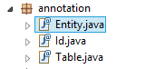
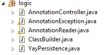

# YayForJ-Persistence [](https://github.com/julidr/YayForJ-Persistence)
>DAO generico en el cual solo se requiere implementar una clase abstracta.


## Requerimientos [](https://github.com/julidr/YayForJ-Persistence/blob/master/pom.xml)
Muchos de los requerimientos ya vienen incluidos en el POM del proyecto, asi que si pueden abrir el proyecto como un proyecto Maven lo más seguro es que les descargue de una vez las dependencias. En cualquier caso dejo el listado:

* Mysql-Connector-Java
  * Version: 5.1.6

## Precauciones [](https://github.com/julidr/YayForJ-Persistence)

* Solo Funciona con MySQL
 * El DAO generico fue pensando para que funcionara con MySQL.
 
* Las anotaciones Entity, Table y ID son Obligatorias.
 * Para que el programa logre reconocer cuales son las clases que representan el modelo, estas deben tener las anotaciones indicadas.

* Los atributos deben llamarse igual tanto en la clase como en la base de datos
 * Los atributos del objeto modelo deben tener los mismos nombres que los atributos de la base de datos. Recomiendo que Intenten usar los nombres de atributos en estilo de documentación Java, es decir, con Mayusculas para separar palabras "idUsuario" y no "id_usuario".

* Esta pensando para bases de datos con id auto incremental
 * El programa funciona de tal forma que no tienen que colocarle ningun valor al atributo de id del objeto, ya que se supone que la base de datos deberia tener este campo como auto incremental.

* Para las inserciones en la base procuren no dejar atributos vacios excepto el id.
 * Es algo a mejorar a futuro, pero por ahora procuren no dejar el objeto a insertar con alguno de sus atributos vacios. El unico que puede y debe estar vacio es el id.

## Funcionamiento [](https://github.com/julidr/YayForJ-Persistence/blob/master/yaytest.sql)

Lo primero que se debe hacer para poder utilizar el proyecto de manera correcta, es crear los modelos que representan las entidades de la base de datos. Para este caso se creara la clase Trainer y haremos el ejemplo del funcionamiento con la base de datos [YayTest](https://github.com/julidr/YayForJ-Persistence/blob/master/yaytest.sql).

```sh
@Entity
@Table(name="trainers")
public class Trainer {
	
	@Id private int id;
	private String name;
	private String lastname;
	private int age;
	private Date birthday;
	
	public int getId() {
		return id;
	}
	
	public void setId(int id) {
		this.id = id;
	}
	
	public String getName() {
		return name;
	}
	
	public void setName(String name) {
		this.name = name;
	}
	
	public String getLastname() {
		return lastname;
	}
	
	public void setLastname(String lastname) {
		this.lastname = lastname;
	}
	
	public int getAge() {
		return age;
	}
	
	public void setAge(int age) {
		this.age = age;
	}
	
	public Date getBirthday() {
		return birthday;
	}
	
	public void setBirthday(Date birthday) {
		this.birthday = birthday;
	}

	@Override
	public String toString() {
		return "Trainer [id=" + id + ", name=" + name + ", lastname=" + lastname + ", age=" + age + ", birthday="
				+ birthday + "]";
	}
}
```
Lo destacable de esta clase son sus anotaciones:

* Entity
 * Esta anotación le indica al programa, que es la representante de una entidad en la base de datos. Si no se coloca se lanzara una excepción.

* Table
 * Esta anotación le indica el nombre de la tabla en la base de datos. En este caso, pese a que la clase se llama Trainer, en la base de datos, la tabla va en plurar y se llama trainers. Por lo que se indica el nombre de la tabla para buscar la referencia correcta. Si falta esta anotación el programa lanza una excepcion.

* Id
 * Esta anotación le indica al programa quien es el id de la clase. Si falta esta anotacion el programa lanza una excepcion.
 
Una vez el modelo esta hecho (y asumiendo que la base de datos tambien) se debe crear la instancia de la clase yayPersistence y mandar los datos necesarios de la base de datos, tales como la referencia, el usuario y contraseña, para establecer la conexión.

```sh
YayPersistence persistenceController= new YayPersistence("jdbc:mysql://localhost:3306/yaytest", "root", "");
```
Si todo se realizo de manera correcta, deberia salir un aviso de conexión exitosa en la consola. <br>
 <br>

Lo siguiente es extender la clase abstracta. Yo recomiendo que lo hagan en una clase donde tengan pensado manejar todos los asuntos del objeto del modelo y que no se limite solo a los metodos basicos que ya viene por defecto. Si no que puedan implementar sus propios metodos basados en InnerJoin y demas relaciones.

Para este ejemplo, cree una clase que se llama TrainerDAO y que extiende de DAOGenerator.

```sh
public class TrainerDAO extends DAOGenerator<Trainer>{

}
```
Ahora si instanciamos esta clase en nuestra aplicación podemos acceder a los 6 metodos que viene por default en el DAO generico.

```sh
TrainerDAO trainerDAO= new TrainerDAO();
```

* FindById
 * Recibe el id de un elemento en especifico de la base de datos y devuelve un objeto relacionado con la clase especificada.
 ```sh
        Trainer trainer=trainerDAO.findById(1l, Trainer.class);
        System.out.println("nombre: " + trainer.getName());
        System.out.println("apellido: " + trainer.getLastname());
        System.out.println("edad: " + trainer.getAge());
        System.out.println("cumpleaños: " + trainer.getBirthday());
```
  El resultado obtenido es efectivamente un objeto de la clase Trainer al cual se le puede acceder a los atributos sin problemas.
  <br>
  

* FindAll
 * Devuelve un ArrayList de objetos segun la clase especificada.
  ```sh
	ArrayList<Trainer> trainersList=trainerDAO.findAll(Trainer.class);
        System.out.println("Tamaño: " + trainersList.size());
        for(int i=0; i<trainersList.size(); i++){
        	System.out.println(trainersList.get(i));
        }
```
  El arrayList contiene todos los objetos de Trainer que se encontraron en la base de datos. Y gracias al toString que se implemento en la clase modelo, se pueden visualizar sin problemas. <br>
   
   
* Save
 * Permite insertar un objeto de una clase en especifico a la base de datos.
   ```sh
	Trainer trainer2= new Trainer();
        trainer2.setName("Natalia");
        trainer2.setLastname("Diaz");
        trainer2.setAge(18);
        SimpleDateFormat formatoDelTexto= new SimpleDateFormat("yyyy-mm-dd");
        trainer2.setBirthday(formatoDelTexto.parse("1998-10-23"));
        trainerDAO.save(trainer2, Trainer.class);
```
  Si la inserción en la base de datos funciona sin problemas, se muestra la setencia SQL que se implemento para agregar el objeto a la base de datos. <br>
   <br>
  Y se puede visualizar la inserción en la base de datos directamente. <br>
  

## Contenido del Proyecto [](https://github.com/julidr/YayForJ-Persistence/tree/master/src/main/java/co/edu/usa/adf/YayForJ_Persistencel)
El contenido del proyecto es bastante simple, considerando que la mayoria de archivos son generados por eclipse y maven para que el proyecto funcione. Por lo que me limitare a explicar los archivos importantes del proyecto, tales como el Pom, los paquetes y algunas clases.

* Pom.xml
 * Si se encuentran familiarizados con Maven, saben que el pom es el documento en donde se establecen las dependencias del proyecto, el cual va y las busca en el repositorio local para no tener que estar agregando los .jar a cada proyecto. En caso de que la dependencia no se encuentre en el repositorio local, la descarga de internet.
 
* Annotation
 * Existe un paquete dentro del proyecto que posee todas las anotaciones hasta el momento. Tales como Entity, Table y Id. <br>
    
    
* Logic
 * El paquete logic trae las clases importantes del proyecto. Posee un AnnotationReader que es la clase encargada de leer las anotaciones de una clase. Tambien incluye el ClassBuilder que es el encargado de construir los objetos dependiendo del tipo de clase que se esta manejando y el YayPersistence que es la encargada de hacer la conexión con la base de datos. <br>
 
 
* Dao
 * Es el paquete que contiene el DAO generico. El cual es una simple clase abstracta que permite la implementación de metodos tales con FindById, FindAll, Save, Update, Delete y FindByX. <br>
 